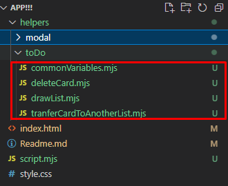

### Task 4 (Refactoring)

**Refactoring** is a practice in software development that involves making improvements to the codebase without changing its external behavior. The primary goal of refactoring is to enhance the code's internal structure, readability, maintainability, and performance, without altering its functionality.

1. Создай папку **helpers** и в ней создай папку для каждой сущности например **toDo**, **modal** и т.д. В созданную папку помести файлы с фичами. Используй расширение **.mjs** и **import/export**.

#### usefull links:

- https://developer.mozilla.org/en-US/docs/Web/JavaScript/Guide/Modules
- https://javascript.info/import-export

  
  

2. Функции должны быть переиспользуемыми, туда должны передоваться аргументы - переделай все функции в соответсвии с этим правилом.
