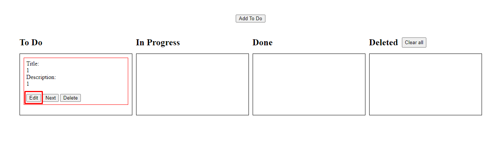
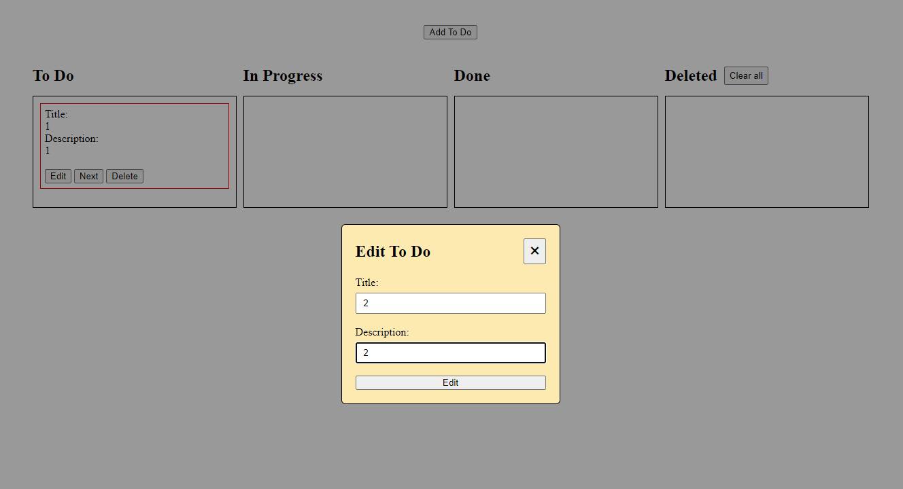
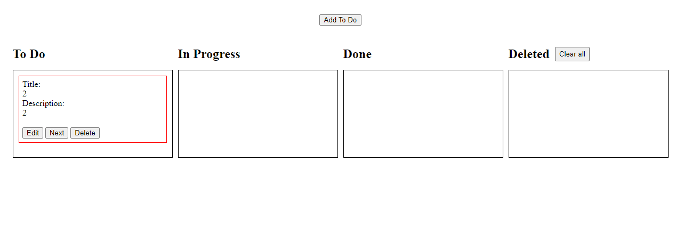
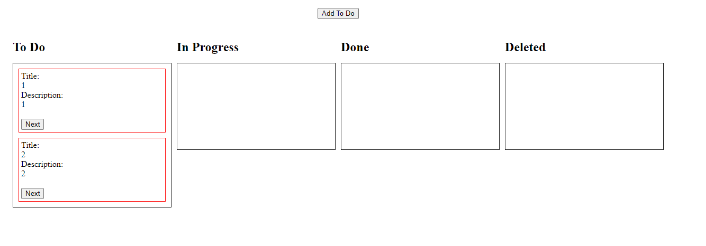
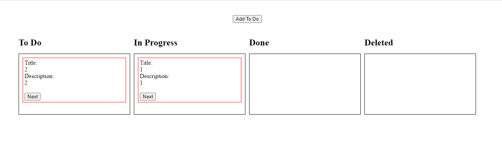

### Задание 3:

1. Добавить кнопку **edit** в карточку, при клике на кнопку появляется модальное окно для редактирования **title** и **description** текущей карточки.  
   
   
   
2. Добавить кнопку **delete** в карточку, при клике на кнопку выбранная карточка переносится в колонку **Deleted**.
   
   
3. В колонке **Deleted** добавить кнопку **clear all**, при нажатие на эту кнопку удаляются все карточки в колонке **Deleted**
   
4. В колонке **Deleted** у каждой карточки добавить кнопку **restore**, при нажатии на эту кнопку выбранная карточка переносится в колонку **To Do**
   
