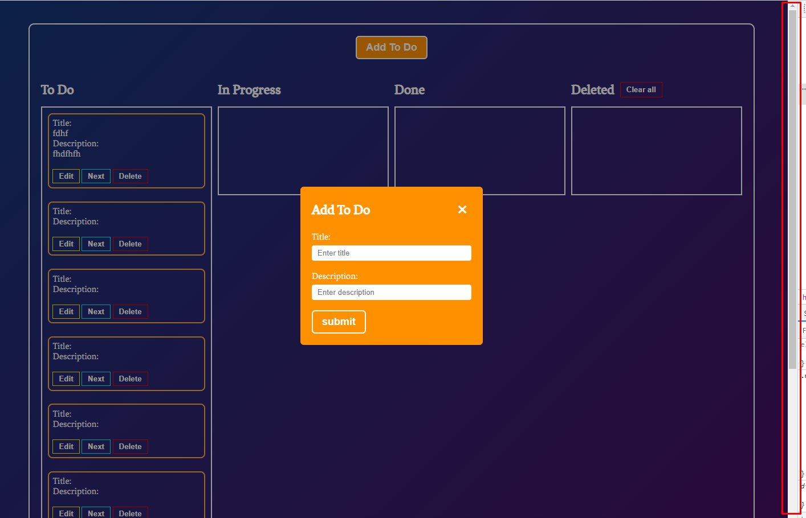
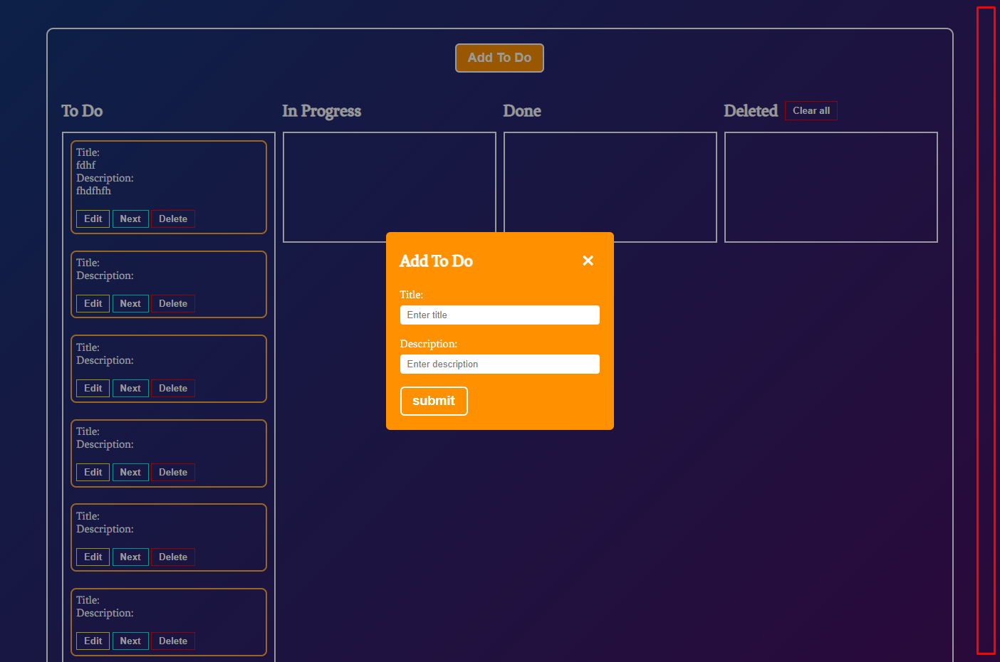

### Задание 2:

1. Создать container для 4-ёх колонок **To Do**, **In Progress**, **Done**, **Deleted**
   
2. При клике на кнопку **submit** в форме **modalTodo** данные заносятся в виде объекта(смотреть описание задания 1) и
   отрисовываются ввиде карточке в колонке **To Do**
   
   
3. У каждой карточки есть кнопка **next** при нажатии выбранная карточка переходит в следующую колонку.
   
4. Добавить репозиторий с именем **ToDoList** и запушить текущии изменения на GitHub
